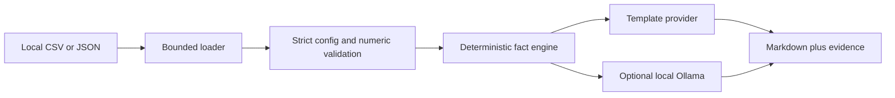

# Evidence-First Data-to-Text Agent

[](https://github.com/kooroosh1363/llm-data-to-text-agent/actions/workflows/ci.yml)

A local-first Python agent that turns CSV or JSON metrics into an auditable Markdown business brief. It works without an API key or paid service. An optional Ollama adapter can generate local narrative wording while deterministic evidence tables remain the source of truth.

## Why this project exists

Many “LLM reporting” demos send raw data to a model and hope the numbers survive. This project separates calculation from language generation:



The model never calculates KPIs. It can only phrase already-computed facts, and the report always includes the auditable evidence used to produce the narrative.

## Features

- CSV and JSON-array inputs; no runtime dependencies
- strict report contract for metrics, aggregations, formatting, grouping, and top-N results
- exact decimal arithmetic for `sum`, `mean`, `min`, `max`, and `count`
- actionable failures for invalid schemas and non-numeric metric values
- atomic output writes, 10 MiB file limit, and 100,000-row limit
- deterministic offline provider by default
- optional local-only Ollama provider with an SSRF-resistant endpoint policy
- unit, integration, CLI, failure-path, and provider-boundary tests
- Python 3.11–3.13 CI and a non-root Docker image

## Quick start: free and offline

```bash
python -m pip install --editable .
d2t-agent \
  --input data/sample/sales.csv \
  --config data/sample/report_config.json \
  --output outputs/sales-brief.md
```

The default output is deterministic and clearly states that no external model or paid API was used. See [`examples/sample-report.md`](examples/sample-report.md) for the checked-in result from the synthetic sample dataset.

## Report configuration

```json
{
  "title": "Regional Sales Brief",
  "metrics": [
    {"column": "revenue", "label": "Revenue", "aggregation": "sum", "format": "currency"},
    {"column": "orders", "label": "Orders", "aggregation": "sum", "format": "integer"}
  ],
  "group_by": "region",
  "top_n": 3
}
```

Supported aggregations are `sum`, `mean`, `min`, `max`, and `count`. Formats are `number`, `integer`, `currency`, and `percent`. Unknown configuration keys are rejected instead of ignored.

## Optional local LLM wording

With [Ollama](https://ollama.com/) running locally and a model already installed:

```bash
d2t-agent \
  --input data/sample/sales.csv \
  --config data/sample/report_config.json \
  --output outputs/ollama-brief.md \
  --provider ollama \
  --ollama-model llama3.2
```

This path is optional, is not exercised against a live model in CI, and requires no paid API. Only the computed fact bundle is sent to the local endpoint. The local model's prose is labeled as unverified wording; numeric evidence is still rendered independently.

## Test and package

```bash
python -m pip install --requirement requirements-dev.txt --editable .
python -m pytest --quiet
python -m build
docker build -t d2t-agent .
```

Example container run:

```bash
docker run --rm \
  -v "$PWD/data/sample:/data:ro" \
  -v "$PWD/outputs:/outputs" \
  d2t-agent \
  --input /data/sales.csv \
  --config /data/report_config.json \
  --output /outputs/report.md
```

## Evidence boundaries

- The checked-in dataset is synthetic and exists only to demonstrate behavior.
- The deterministic provider summarizes configured metrics; it does not explain causes or forecast outcomes.
- The Ollama adapter is optional and its prose still requires human review.
- This is production-oriented portfolio software, not a claim of a deployed production service.

See [SECURITY.md](SECURITY.md) for the input and local-model trust boundaries.

